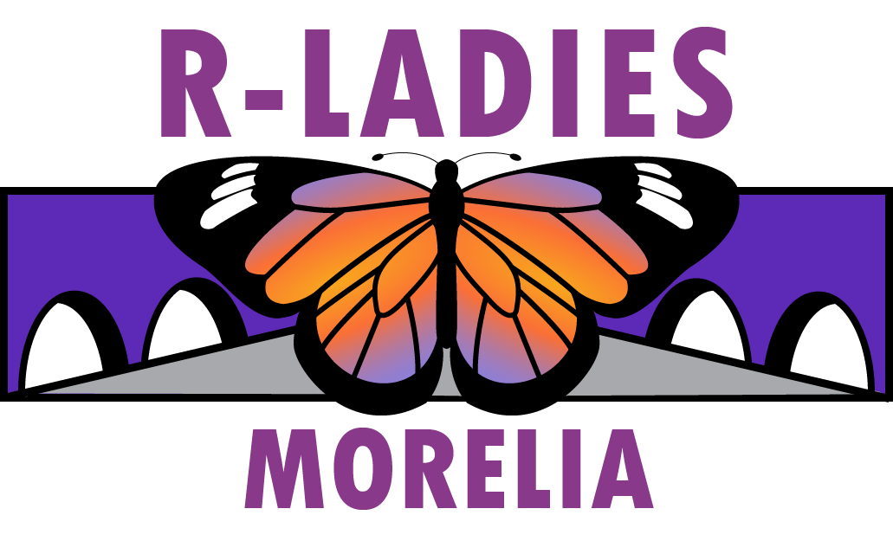

    

<h2 style="text-align: center;">Hackaton 2024</h2>

<h1 style="text-align: center;">Genera tu Curriculum Vitae en R</h1>

  Guía práctica para hacer tu CV en R y no morir en el intento

  Autora:[Aline Pingarroni](https://github.com/AlinePingarroni)

#### Materiales informativos
Este material fue modificado del taller que impartió Dra. [EveliaCoss](https://github.com/EveliaCoss/Make_yourCV) el cual se construyó a partir de las siguientes fuentes:

- [datadrivencv](https://github.com/nstrayer/datadrivencv) - Tutorial del creador del paquete (cv.Rmd)
- [Monica Padilla-Rladies](https://github.com/mpadilla905/curso-cv/tree/main/slides) - Presentacion en el encuentro de Rladies Mexico
- [Monica Padilla-CV](https://github.com/mpadilla905/mpadilla905.github.io) - CV de Monica Padilla (cv.rmd)
- [Leonardo Collado-CV](https://github.com/lcolladotor/cv) - CV del Dr. Leonardo Collado (index.Rmd)

## 1. El paquete datadrivencv

El paquete datadrivencv facilita aún más la creación y mantenimiento de un CV dinámico y actualizado automáticamente. 

Este paquete se basa en la filosofía de datos impulsados (data-driven), lo que significa que puedes mantener tu información en un formato estructurado (como un archivo de datos) y generar tu CV a partir de estos datos.

### 1. 1 Ventajas de datadrivencv
1. **Automatización Completa**: Centraliza la información de tu CV en un archivo de datos. Las actualizaciones en este archivo se reflejan automáticamente en el documento generado.
2. **Facilidad de Mantenimiento**: Puedes actualizar tu CV simplemente modificando los datos subyacentes en lugar de editar manualmente el documento final.
3. **Integración con Google Sheets**: Puedes mantener tu información en Google Sheets y sincronizarla fácilmente, facilitando la colaboración y la actualización desde cualquier lugar.
4. **Consistencia de Formato**: Garantiza que todos los elementos de tu CV tengan un formato coherente y profesional, usando plantillas prediseñadas.
5. **Personalización**: Ofrece opciones para personalizar la apariencia de tu CV utilizando plantillas y estilos CSS.

## 2. Preparación del material

### 2.1 Revisar que la carpeta descargada contenga los archivos necesarios:

| Archivo                     | Descripción                                                                                                                                                                                                                                                                           |
| ------------------------- | -------------------------------------------------------------------------------------------------------------------------------------------------------------------------------------------------------------------------------------------------------------------------------------- |
| `cv.rmd`                  | Un archivo RMarkdown con varias secciones completadas. Editable.                                                                                                                                                                                              |
| `dd_cv.css`               | Un conjunto personalizado de estilos CSS que se basan en la plantilla de "currículum" predeterminada "Pagedown". Editable.                                                                                                                                                                       |
| `render_cv.r`             | Script para crear su CV en PDF y HTML al mismo tiempo.                                                                                                                                                                                            |
| `cv_printing_functions.r` | Una serie de funciones que realizan el trabajo sucio de convertir los datos de su hoja de cálculo en Markdown/html y hace que esa salida funcione para la impresión de PDF. Por ejemplo, Reemplazar enlaces con superíndices y una sección de enlaces, ajustar el CSS para tener en cuenta las peculiaridades de la impresión en Chrome, etc.|

### 2.2 Paquetes necesarios 📕

- [rmarkdown](https://rmarkdown.rstudio.com/articles_intro.html)-Crea documentos reproducibles que combinan código, texto y resultados de análisis en múltiples formatos.
- [pagedown](https://github.com/rstudio/pagedown)-Crea documentos web de alta calidad y documentos imprimibles  
- [devtools](https://www.r-project.org/nosvn/pandoc/devtools.html) -Facilita el desarrollo de paquetes R al proporcionar funciones para crear, documentar, probar, y distribuir paquetes de manera más eficiente.
- [datadrivencv](https://nickstrayer.me/datadrivencv/)-Crea y actualiza currículums vitae (CVs) y perfiles profesionales
- [fontawesome](https://github.com/rstudio/fontawesome)-proporciona acceso a la biblioteca de íconos FontAwesome, permite agregar íconos de alta calidad y estilo.

### 2.3 Duplica un documento [google sheets](https://docs.google.com/spreadsheets/create?hl=es)

Consideraciones:

- No colocar simbolos raros en el archivo de google.

- El archivo de google debes darle acceso de edicion antes de copiar el link.

El archivo tipo hoja de cálculo se compone de cuatro hojas que corresponden a diferentes secciones del CV:

HOJA 1 **entries**:

- **educacion**: información sobre tu trayectoria académica.
- **experiencia_laboral**: experiencia laboral.
- **docencia**: clases.
- **tesistas**: tesistas asesorados.
- **articulos_academicos**: artículos científicos publicados.

**Bonus:** Puedes agregar nuevas secciones en esta parte y aparecerán en el R Markdown cuando las menciones. Si quieres saber más sobre las columnas de entries, puedes localizarlo en [datadrivencv/entries](https://docs.google.com/spreadsheets/d/14MQICF2F8-vf8CKPF1m4lyGKO6_thG-4aSwat1e2TWc/edit#gid=917338460).

- Hoja 2 **language_skills**: Informacion sobre los lenguajes de programacion que manejas.

- Hoja 3 **text_blocks**: Informacion sobre ti. Un preve resumen de tu trayectoria o gustos, puede ser en la industria, desarrollando paquetes o tal vez enseñando.

- Hoja 4 **contact_info**: Como te pueden contactar. Tus redes sociales.

- Hoja 5 **programming_languagues**: creado por Monica Padilla el cual muestra las fortalezas en el manejo de lenguajes de programacion clasificandolos como Expertos (expertise) o (familiarity) en los cuales tenemos algunos conocimientos.

 Existen diferentes ejemplos de CVS con el formato necesarío que podrás ver  al final de la explicación. 

 En este caso utilizaremos la siguiente plantilla: 

[CV_Espanol](https://docs.google.com/spreadsheets/d/1iuzJh7isW4omxbfv04zlOMwojN_VKCLN8g9wh_SJfT4/edit?usp=sharing), Generar un copia en tu archivos de google --> Archivo/Hacer una copia

### 2.4 Crear un proyecto
- File --> New Project --> Existing directory --> Elegir carpeta con el documento

### 2.5. Abrir tu script en Rmarkdown (CV.Rmd)

Para la generacion de tu script CV.Rmd, vamos a utilizar el archivo de **CV_Espanol.Rmd** que se encuentra en su carpeta. 

Abajo también hay otros ejemplos que puedes descargar como base cualquiera y eligir el que se adapte mejor a tus necesidades. 

